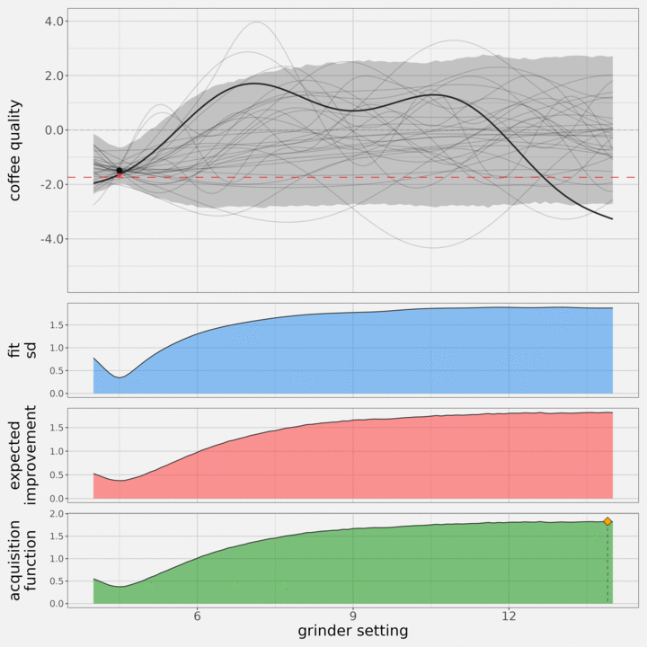
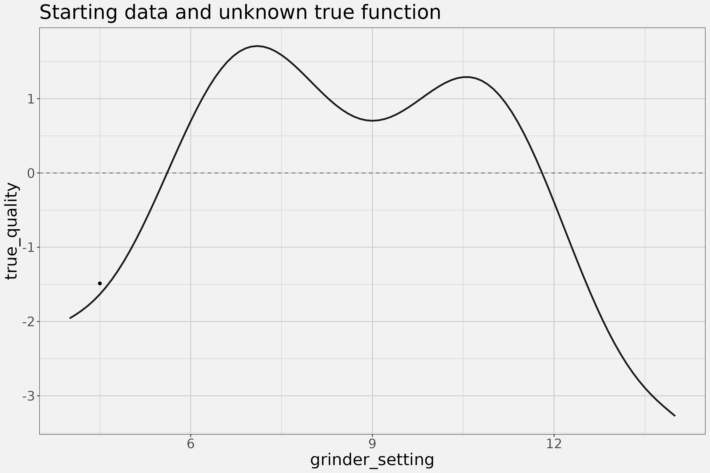

<!-- README.md is generated from README.Rmd. Please edit that file -->

# dyingforacup

[DO YOU FOLKS LIKE
COFFEE?!](https://www.youtube.com/watch?v=RJC9DXQAd7U)

<!-- badges: start -->
<!-- badges: end -->

This is the package I use to optimize my coffee brewing with [Bayesian
Optimization](https://www.youtube.com/watch?v=wZODGJzKmD0).

## Installation

You need to install
[`cmdstanr`](https://mc-stan.org/cmdstanr/index.html) to use this
package:

``` r
# we recommend running this is a fresh R session or restarting your current session
install.packages("cmdstanr", repos = c("https://stan-dev.r-universe.dev", getOption("repos")))
```

then use that to install CmdStan:

``` r
install_cmdstan(cores = 2)
```

After that, you can install the development version of `dyingforacup`
like so:

``` r
remotes::install_github('andrewGhazi/dyingforacup', type = "source")
```

## 1D Example animation

This will give you the gist of it:



The point of this package is to suggest coffee brewing configurations in
brew parameter space that balance A) improving the expected rating and
B) exploring the space. There are *many* dials to turn when brewing
coffee, and it’s practically impossible to try every combination of
grind size, temperature, bloom time, etc.

Say you only had one brew parameter: the coarseness dial on the grinder.
Imagine the true, unknown relationship between grinder setting and
coffee quality looks like this:



You have one starting observation at 4.5 (too fine, so the observed
rating is low). There’s a bit of noise about the true function. What
setting should you try next?

If you use Gaussian processes and [Bayesian
Optimization](https://www.youtube.com/watch?v=wZODGJzKmD0), you can get
suggestions that are, in a sense, optimal. The suggestions balance
identifying/refining promising regions and collapsing uncertainty in
unexplored regions. Let’s look again at the gif demonstrating automated
suggestions along a one-dimensional brew parameter space for grinder
setting. At each iteration, you fit a GP to the data, then use that fit
to determine where the next data point should be collected:


There’s a lot going on in that animation. This explains each panel:

- Top panel:
  - dark grey line: same true (unknown) relationship between grinder
    setting and coffee quality as above
  - points: noisy observed ratings about that function
  - light grey lines: posterior draws for the relationship from the GP
  - grey ribbon: 90% predictive interval of a new coffee brewed at the
    given setting
  - red arrow & dashed line: the previous best observation shifted down
    by a set amount (`offset`, the length of the red arrow).
- 2nd panel, blue function: fit sd, the sd of the light grey lines
  (which is not the same thing as the width of the grey ribbon)
- 3rd panel, red function: expected improvement: the expectation value
  of a new coffee at the given setting falling above the dashed red
  line.
- bottom pane, green function: the acquisition function, a weighted
  mixture of the two curves above.
  `lambda * blue + (1-lambda) * red = green`
  - orange diamond: maximum point on the acquisition function = next
    suggested point

You can see that first it suggests a very high setting because that’s
where there’s the most uncertainty given the first point. After that
turns out badly as well, it tries in the middle. That does much better,
after which it hones in on the global maximum (it gets somewhat lucky
and finds a near-optimal point at only the fourth suggestion). After
that it tries elsewhere in the space, collapsing uncertainty wherever
it’s high to see if there’s some other hidden peak.

## Usage

As the last frame of the gif suggests, this process can be extended to
an arbitrary number of brew parameters. Bear in mind that this isn’t
magic, and finding optima in higher dimensional spaces will require many
more observations. This is especially true if the ratings are noisy, so
try hard to give each cup a fair, normally-distributed rating. Speaking
of, integer ratings of 0-10 aren’t allowed, the ratings have to be
normally distributed. That might change if I feel like implementing it.

Give the `suggest_next()` function a data frame of brew parameters with
ratings and it will suggest a point to try next that has high predicted
probability of improving the rating.

``` r
library(dyingforacup)

options(mc.cores = 4, digits = 3)

dat = data.frame(grinder_setting = c(  8,    7,   9), 
                 temp            = c(193,  195, 179),
                 bloom_time      = c( 25,   20,  45),
                 rating          = c(1.1, -0.7,  -1))

suggest_next(dat,
             lambda          = .1,    # exploration parameters
             offset          = .33,
             iter_sampling   = 1000,  # sampler parameters
             refresh         = 100,
             show_exceptions = FALSE, 
             parallel_chains = 4)
```

    $draws_df
    ...

    $acq_df
    ...

    $suggested
       post_sd exp_imp   acq grinder_setting  temp bloom_time
         <num>   <num> <num>           <num> <num>      <num>
    1:    1.19   0.464 0.536               9   195         30

This returns a list of MCMC draws, the acquisition function values over
a grid of brew parameters, and a suggestion on where to go next.
`offset` and `lambda` can be tweaked to control exploration vs
exploitation, but expect to be suggested some combinations that result
in really bad coffee sometimes (especially early on before it has
collapsed the uncertainty along the outer edges of the parameter space).
See `?suggest_next` for more detail on these function arguments and
more.

Once you have a grid point to try, use `suggest_tune()` to get a
coffee-related song to listen to while you brew!

## TODO list

Easy:

- User prior input
- Other acquisition functions
- Viz functions

Medium:

- Non-normal outcome
- Fast GP approximations for 1D/2D datasets with
  [`gptools`](https://github.com/onnela-lab/gptools/tree/main) or
  [Hilbert spaces](https://arxiv.org/abs/2004.11408)

Hard:

- ARD / parameter-specific length-scales
- heteroscedasticity

Nightmare:

- Fast GP approximations for 3D+
  - This would probably require some custom ND FFT functions
- Refactor to use INLA
